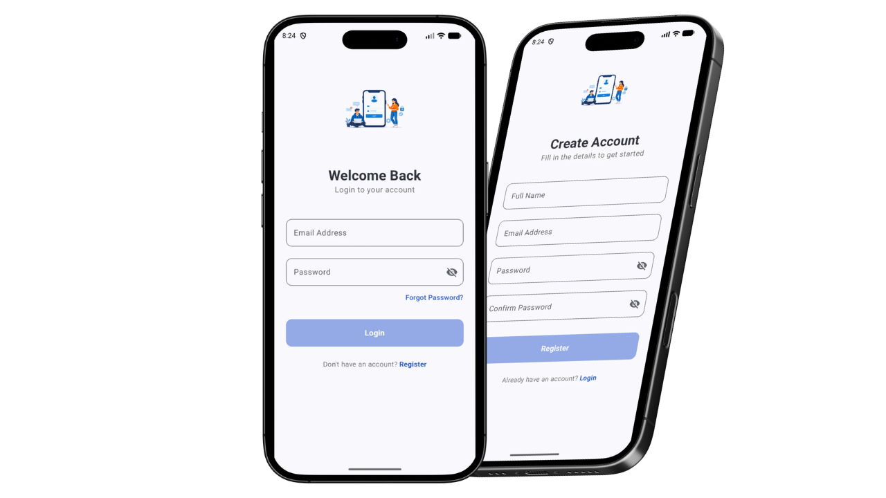

# 🔐 Login & Create Account - Jetpack Compose

This project is a simple Android UI application built using **Jetpack Compose**.  
It provides a clean interface for **Login** and **Account Creation**, with basic navigation between screens.

---

## ✨ Features

- 🔑 Login Screen
- 📝 Create Account Screen
- 🔄 Navigation between screens
- 🎨 Modern UI with Jetpack Compose

---

## 📱 Screenshots

---

## 🛠️ Technologies Used

- Kotlin
- Jetpack Compose
- Android Studio

---

## 🚀 How It Works

- User can choose to:
  - Login with existing account
  - Create a new account
- Navigation switches between Login and Sign Up screens

---

## 📂 Project Structure

- `ui/` → contains UI screens
- `navigation/` → handles screen navigation
- `MainActivity.kt` → app entry point

---

## 📌 Notes

This project focuses only on the **UI and navigation**.  
No backend or authentication system is implemented.

---

## 👨‍💻 Author

**Tarik Oulehiane**

- LinkedIn: https://www.linkedin.com/in/tarikoulehiane/
